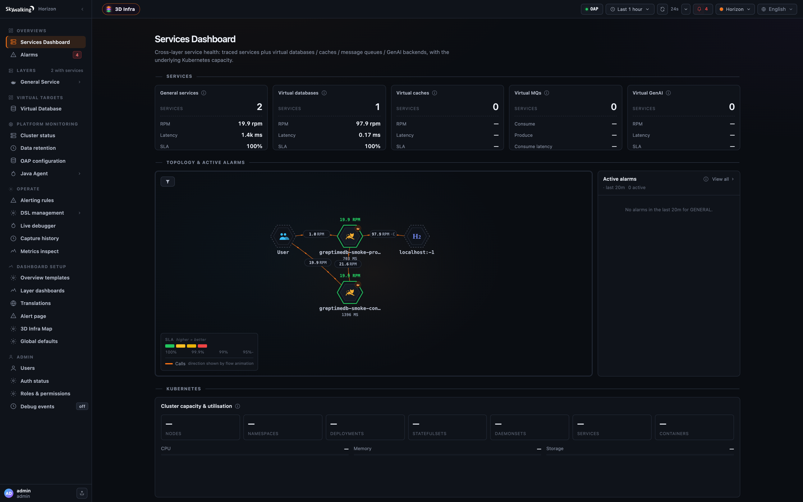
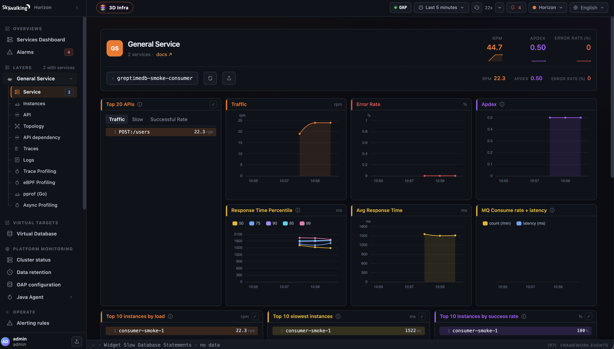
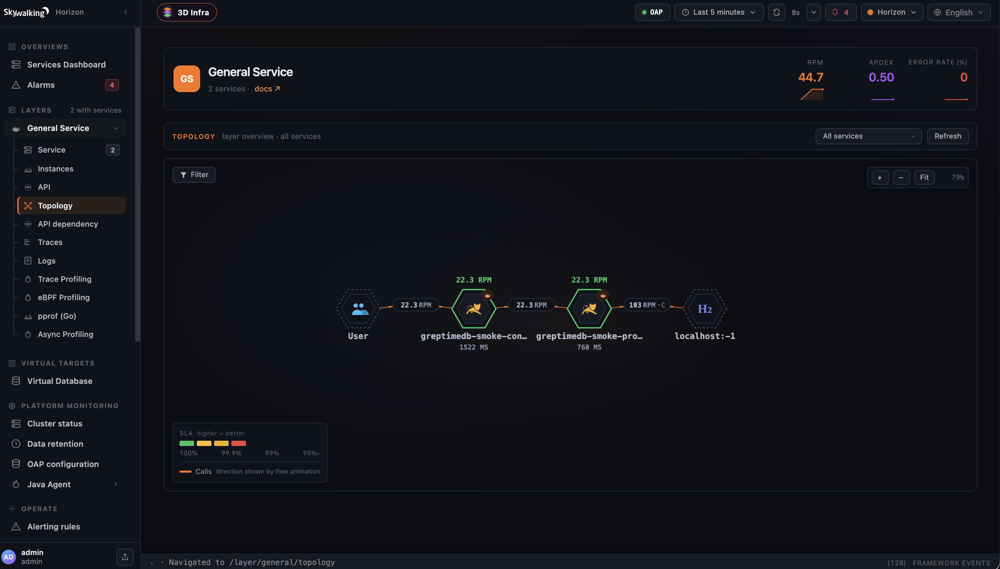
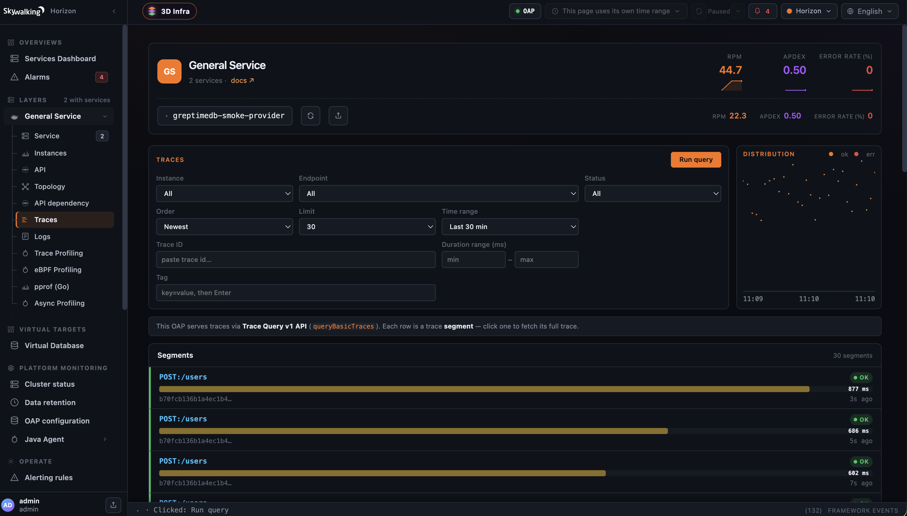
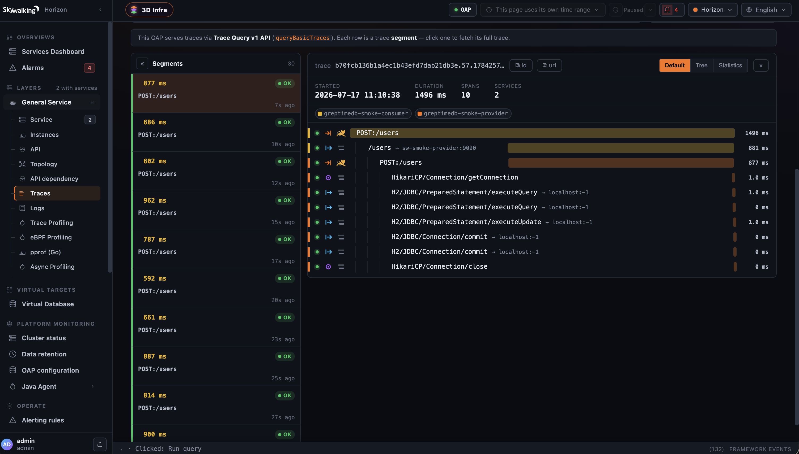
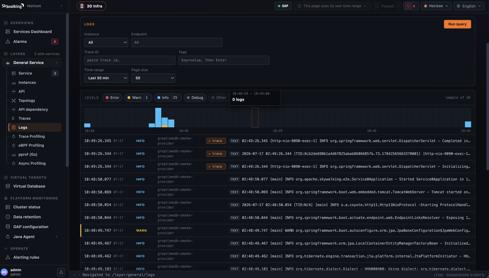
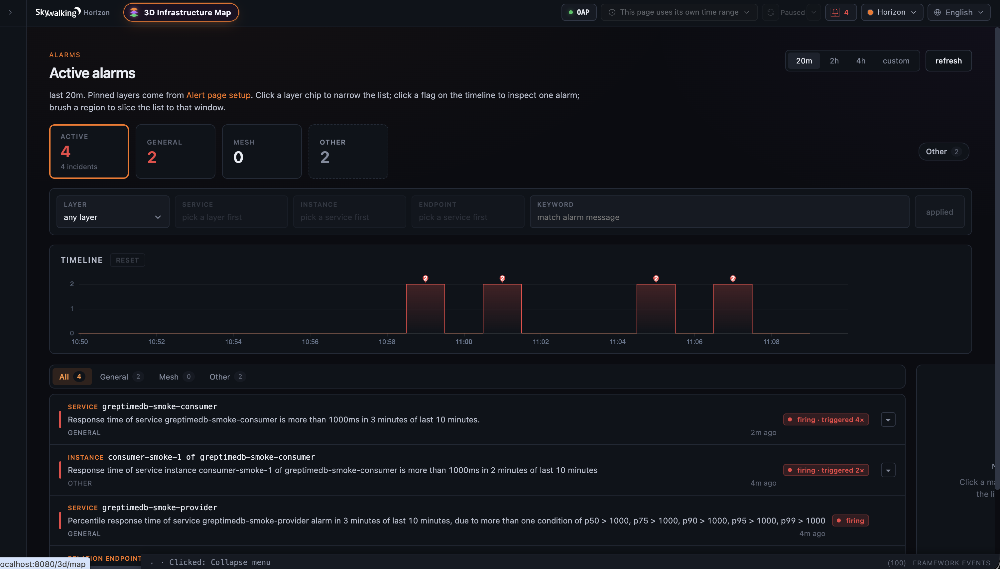

## GreptimeDB

<p align="center">
  <a href="../../../../en/setup/backend/storages/greptimedb.md">English</a> | <a href="greptimedb.md">简体中文</a>
</p>

将 storage provider 设置为 `greptimedb`，即可使用 [GreptimeDB](https://github.com/GreptimeTeam/greptimedb) 作为 SkyWalking OAP 的存储后端。

### 可用版本

本文档对应非官方下游版本 [`v11.0.0-greptimedb.2`](https://github.com/killme2008/skywalking/releases/tag/v11.0.0-greptimedb.2)。该版本基于 Apache SkyWalking `11.0.0-SNAPSHOT`，对应上游 commit [`46129f18`](https://github.com/apache/skywalking/commit/46129f18e815829ea14afce9a013bae7d8dfdc66)。

该 plugin 尚未进入 Apache Software Foundation 的正式发行版。官方 `apache/skywalking-oap-server` 镜像不包含它，请使用下方快速开始中的下游镜像。

### 推进上游支持

Apache SkyWalking 社区正在 [Discussion #13722](https://github.com/apache/skywalking/discussions/13722) 中讨论正式支持 GreptimeDB storage。如果你希望在 SkyWalking 中使用 GreptimeDB，欢迎在 Discussion 中说明实际场景。数据规模、保留时间、部署方式和依赖的查询能力，比单纯回复 `+1` 更有参考价值。

### 支持范围

| 领域 | 当前能力 |
| --- | --- |
| Metrics | 支持 SkyWalking metrics 写入和查询，使用 last-row merge 语义和 GreptimeDB 原生 TTL。 |
| Records | 支持 traces、logs、alarms、events、browser error logs 和 Zipkin data。Records 采用 append-only 模式，TTL 可配置。 |
| Search | 支持按 searchable trace、log、alarm tags 和 Zipkin annotations 精确过滤；通过 `matches_term` 查询日志关键词。 |
| Profiling | 支持 trace profiling、async-profiler、eBPF profiling、pprof、JFR data 和 span-attached events。 |
| Management data | 支持 UI templates、runtime rules、network address aliases、service labels 和 continuous-profiling policies。 |
| Cluster access | 写入可配置多个 gRPC endpoints；JDBC 可配置多个 frontend endpoints，并通过 Connector/J 提供 load balancing 和 failover。 |

GreptimeDB 专用 E2E 覆盖 core storage、logs、alarms、Zipkin、trace profiling 和 pprof。其他已注册 DAO 由单元测试或共享的 storage behavior 覆盖，但目前不一定有独立的 GreptimeDB E2E case。

### 前置条件

- GreptimeDB 最低已测版本为 v0.15.5。CI 覆盖 v0.15.5 和 v1.1.2，v0.17.2 也已通过下文的冒烟测试。
- MySQL Connector/J。SkyWalking 源码、二进制发行包和下游镜像均不包含该 driver。
- GreptimeDB 用户需要能连接 `public` database、创建目标 database 和 tables，并能读写目标 database。

MySQL Connector/J 使用 [GPLv2 with the Universal FOSS Exception](https://github.com/mysql/mysql-connector-j/blob/release/8.x/LICENSE)。Apache 将 GPL 依赖及大多数例外归为 [Category X](https://www.apache.org/legal/resolved.html#category-x)，不允许打进 ASF 发行物。这个下游版本沿用同样的分发边界，因此需要用户自行获取 driver。

当前 E2E 使用 Connector/J 8.0.13，项目尚未验证其他版本。

### Docker 快速开始

下面会在同一个 Docker network 中启动一个临时 GreptimeDB 实例和下游 OAP 镜像。GreptimeDB 数据保存在容器内，删除容器也会删除数据。

下载 E2E 使用的 Connector/J 版本：

```bash
export MYSQL_CONNECTOR_VERSION=8.0.13
export MYSQL_CONNECTOR_J="${PWD}/mysql-connector-java-${MYSQL_CONNECTOR_VERSION}.jar"

curl --fail --location \
  --output "${MYSQL_CONNECTOR_J}" \
  "https://repo.maven.apache.org/maven2/mysql/mysql-connector-java/${MYSQL_CONNECTOR_VERSION}/mysql-connector-java-${MYSQL_CONNECTOR_VERSION}.jar"
```

创建 Docker network 并启动 GreptimeDB：

```bash
docker network create skywalking-greptimedb

docker run -d \
  --name greptimedb \
  --network skywalking-greptimedb \
  -p 4000:4000 \
  -p 4001:4001 \
  -p 4002:4002 \
  greptime/greptimedb:v1.1.2 \
  standalone start \
  --http-addr=0.0.0.0:4000 \
  --rpc-bind-addr=0.0.0.0:4001 \
  --mysql-addr=0.0.0.0:4002

for attempt in {1..60}; do
  if curl --fail --silent http://127.0.0.1:4000/health > /dev/null; then
    break
  fi
  if [ "${attempt}" -eq 60 ]; then
    echo "GreptimeDB did not become healthy" >&2
    docker logs greptimedb
    exit 1
  fi
  sleep 2
done
```

启动 OAP 并启用 GreptimeDB storage：

```bash
docker run -d \
  --name skywalking-oap \
  --network skywalking-greptimedb \
  -p 11800:11800 \
  -p 12800:12800 \
  -p 9411:9411 \
  -v "${MYSQL_CONNECTOR_J}:/skywalking/ext-libs/mysql-connector-j.jar:ro" \
  -e SW_STORAGE=greptimedb \
  -e SW_STORAGE_GREPTIMEDB_GRPC_ENDPOINTS=greptimedb:4001 \
  -e SW_STORAGE_GREPTIMEDB_JDBC_ENDPOINTS=greptimedb:4002 \
  -e SW_STORAGE_GREPTIMEDB_DATABASE=skywalking \
  -e SW_HEALTH_CHECKER=default \
  -e SW_RECEIVER_ZIPKIN=default \
  -e SW_QUERY_ZIPKIN=default \
  -e "JAVA_OPTS=-Xms1g -Xmx1g" \
  ghcr.io/killme2008/greptimedb-oap:11.0.0-greptimedb.2
```

OAP 启动时会创建 `skywalking` database 和所需 tables。等待 health endpoint 返回成功：

```bash
for attempt in {1..60}; do
  if curl --fail --silent http://127.0.0.1:12800/healthcheck > /dev/null; then
    break
  fi
  if [ "${attempt}" -eq 60 ]; then
    echo "OAP did not become healthy" >&2
    docker logs skywalking-oap
    exit 1
  fi
  sleep 5
done
```

#### 启动 Horizon UI

在任意目录创建一份独立的 Horizon 配置。OAP hostname 必须和 Docker network
中的 OAP container name 一致：

```bash
export HORIZON_CONFIG="${PWD}/horizon-greptimedb.yaml"

cat > "${HORIZON_CONFIG}" <<'EOF'
server:
  host: 0.0.0.0
  port: 8081

oap:
  queryUrl: http://skywalking-oap:12800
  adminUrl: http://skywalking-oap:17128
  zipkinUrl: http://skywalking-oap:9412/zipkin

auth:
  backend: local
  local:
    users:
      - username: admin
        passwordHash: "$argon2id$v=19$m=65536,t=3,p=4$joV9AVlyLS3pqq4mLrYokQ$pJLkTKrz9/LzEH6YaFljdz9k8dyBiryjwSB26Diiz9U"
        roles: [admin]
EOF
```

在同一个 Docker network 中启动官方 Horizon UI：

```bash
docker run -d \
  --name skywalking-ui \
  --network skywalking-greptimedb \
  -p 8080:8081 \
  -v "${HORIZON_CONFIG}:/app/horizon.yaml:ro" \
  apache/skywalking-ui:latest
```

浏览器打开 <http://localhost:8080>，使用 `admin` / `admin` 登录。这个账号只用于
本地测试，对外开放 UI 前必须修改。

Agent 向 `11800` 端口发送 telemetry data。`12800` 是 OAP query API 和 health
endpoint，不是 Web UI。Horizon 的配置和部署方式见[英文 UI 配置文档](../../../../en/setup/backend/ui-setup.md)。

#### 在 Horizon 中验证数据

将 SkyWalking Agent 指向 `127.0.0.1:11800`，然后向被观测服务发送流量。Metrics
按分钟聚合，通常需要等待一到两个分钟窗口，所有 dashboard 才会出现数据。下面的
截图来自一个 smoke workload：consumer 调用 provider，provider 再访问 H2。

Services Dashboard 汇总了活跃服务、RPM、延迟、SLA 和当前 topology：



选择一个 service，可以检查 traffic、error rate、Apdex、响应时间分位数和 instance metrics：



Topology 中应当同时出现两个 services 及其 database dependency：



持续发送流量时，Traces 页面应当不断返回成功的 segments：



打开任意 segment，可以检查跨服务 reference 和 database spans：



如果 Agent 上报 application logs，Logs 页面应当能查询到日志；包含 trace ID 的日志
还会显示 trace link：



这里的 smoke workload 每次请求耗时超过一秒，会触发 SkyWalking 默认的响应时间告警。
Alarms 页面可以验证 alarm records 同样经过 GreptimeDB 写入和查询：



如果 OAP 一直没有变为 healthy，检查启动日志：

```bash
docker logs skywalking-oap
```

使用二进制发行包时，将 Connector/J jar 复制到 `oap-libs`，不需要挂载 `/skywalking/ext-libs`。

### 配置

在 `application.yml` 中选择 GreptimeDB storage provider：

```yaml
storage:
  selector: ${SW_STORAGE:greptimedb}
  greptimedb:
    # GreptimeDB gRPC write endpoint(s), comma-separated for multiple endpoints.
    grpcEndpoints: ${SW_STORAGE_GREPTIMEDB_GRPC_ENDPOINTS:127.0.0.1:4001}
    # GreptimeDB MySQL-compatible protocol endpoint(s) for JDBC reads and DDL.
    jdbcEndpoints: ${SW_STORAGE_GREPTIMEDB_JDBC_ENDPOINTS:127.0.0.1:4002}
    database: ${SW_STORAGE_GREPTIMEDB_DATABASE:skywalking}
    user: ${SW_STORAGE_GREPTIMEDB_USER:""}
    password: ${SW_STORAGE_GREPTIMEDB_PASSWORD:""}
    # TTL per data category. Use GreptimeDB duration format, for example "7d" or "168h".
    metricsTTL: ${SW_STORAGE_GREPTIMEDB_METRICS_TTL:7d}
    recordsTTL: ${SW_STORAGE_GREPTIMEDB_RECORDS_TTL:3d}
    maxJdbcPoolSize: ${SW_STORAGE_GREPTIMEDB_MAX_JDBC_POOL_SIZE:10}
    metadataQueryMaxSize: ${SW_STORAGE_GREPTIMEDB_QUERY_MAX_SIZE:5000}
```

| 配置项 | 环境变量 | 默认值 | 说明 |
| --- | --- | --- | --- |
| `grpcEndpoints` | `SW_STORAGE_GREPTIMEDB_GRPC_ENDPOINTS` | `127.0.0.1:4001` | GreptimeDB gRPC 写入 endpoints，多个地址用逗号分隔。 |
| `jdbcEndpoints` | `SW_STORAGE_GREPTIMEDB_JDBC_ENDPOINTS` | `127.0.0.1:4002` | GreptimeDB MySQL 查询和 DDL endpoints。配置多个地址时，Connector/J 负责 load balancing 和 failover。 |
| `database` | `SW_STORAGE_GREPTIMEDB_DATABASE` | `skywalking` | Database 名称，不存在时由 OAP 创建。 |
| `user` | `SW_STORAGE_GREPTIMEDB_USER` | `""` | 用户名。 |
| `password` | `SW_STORAGE_GREPTIMEDB_PASSWORD` | `""` | 密码。 |
| `metricsTTL` | `SW_STORAGE_GREPTIMEDB_METRICS_TTL` | `7d` | 所有 downsampling levels 的 metrics TTL。 |
| `recordsTTL` | `SW_STORAGE_GREPTIMEDB_RECORDS_TTL` | `3d` | Traces、logs、alarms、profiling data 和其他 records 共用的 TTL。 |
| `maxJdbcPoolSize` | `SW_STORAGE_GREPTIMEDB_MAX_JDBC_POOL_SIZE` | `10` | JDBC connection pool 的最大连接数。 |
| `metadataQueryMaxSize` | `SW_STORAGE_GREPTIMEDB_QUERY_MAX_SIZE` | `5000` | 查询 services、instances 和 endpoints 时返回的最大行数。 |

### 架构和数据模型

Plugin 使用两种 GreptimeDB 协议：

- 通过 4001 端口的 gRPC 和 [GreptimeDB Java Ingester SDK](https://docs.greptime.com/user-guide/ingest-data/for-iot/grpc-sdks/java) 异步写入。
- 通过 4002 端口的 MySQL protocol 和 JDBC 执行查询、DDL 和 database bootstrap。

不同 SkyWalking model 使用不同的 GreptimeDB table mode：

| SkyWalking model | GreptimeDB mode | 行为 |
| --- | --- | --- |
| Metrics | `merge_mode='last_row'` | Upsert 聚合后的时序数据。 |
| Records | `append_mode='true'` | Append traces、logs、alarms 和 profiling data 等时序 records。 |
| Management | `merge_mode='last_row'` | 按 `id` upsert 当前配置。 |

Searchable trace、log、alarm tags 和 Zipkin annotations 以规范化行的形式存入额外的 append-only tables。原始 `key=value` 使用 skipping indexes，精确过滤使用关联 `EXISTS` 子查询。修改 searchable-tag whitelist 不会改变 table schema。

Current-state metadata 按小时保存快照。Metrics 通过 `merge_mode='last_row'`，每个 series 每小时只保留一个物理版本。UI templates、continuous-profiling policies 等 management data 使用 `ttl = 'forever'`。

GreptimeDB 通过 table options 应用 TTL，并通过 TIME INDEX 处理按时间分区。Plugin 不创建按日期分区的 tables，也不执行手动历史数据清理。

### 集群部署和传输安全

在 `jdbcEndpoints` 中列出所有 GreptimeDB frontend MySQL endpoints，例如：

```text
frontend-0:4002,frontend-1:4002,frontend-2:4002
```

Plugin 在 database bootstrap 和 JDBC connection pool 中使用 Connector/J load balancing。某个 frontend 不可用时，会切换到其他已配置的 endpoint。`grpcEndpoints` 同样支持以逗号分隔多个 GreptimeDB gRPC endpoints。

当前 plugin 支持用户名和密码认证，但没有 TLS 或 CA 配置。不要通过不可信网络传输凭证或 telemetry data。生产环境应使用可信私有网络或本地 TLS terminating proxy。当前版本尚未验证 OAP 直连 TLS endpoint。

GreptimeDB replication、sharding 和 storage placement 在 GreptimeDB 侧配置，不属于 OAP plugin 的配置范围。集群部署见 [GreptimeDB 文档](https://docs.greptime.com/)。

### Schema 变更和升级

OAP 会自动建表。后续启动时，它会根据生成的 schema 校验 columns、primary keys、indexes、table mode 和 TTL。Plugin 不会自动修改或迁移不兼容的 table。

修改 `metricsTTL`、`recordsTTL`，或者升级到生成不同 schema 的 plugin 版本，都可能导致校验失败。不要为了让 OAP 启动而直接删除生产 table，drop table 会丢失数据。先备份数据，或者配置新的 database，让 OAP 创建一套新 schema。

### 已知限制

- 日志全文检索使用 English analyzer。
- SkyWalking Trace V2 query 目前只支持 BanyanDB storage。
- Current-state metadata 按小时保留快照，不保留同一小时内的分钟级历史。
- Plugin 没有 gRPC 或 JDBC TLS/CA 配置，尚未验证 direct TLS。
- 不支持自动 schema migration。
