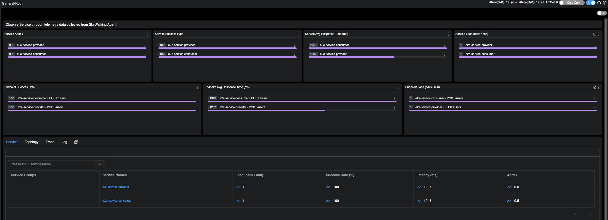
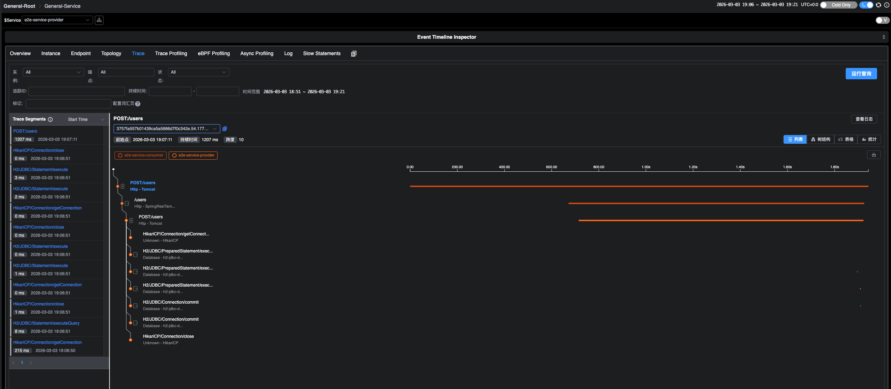
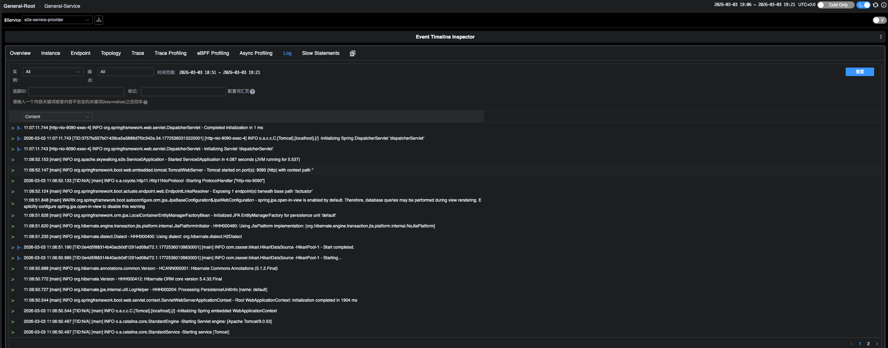

# Testing the GreptimeDB Storage Plugin

This document covers how to try out, test, and develop the GreptimeDB storage plugin.

## Prerequisites

- JDK 17
- Docker and Docker Compose
- Go (for E2E tool installation)

## Quick Start Demo

A standalone Docker Compose file (`docker-compose-greptimedb-demo.yml`) at the project root
provides a full SkyWalking + GreptimeDB environment. This is the easiest way to try the plugin.

### Step 1: Build

```bash
# Build the OAP distribution (skip tests)
./mvnw clean install -Pbackend,dist -Dmaven.test.skip

# Build the Docker OAP image
make docker.oap

# Build the E2E test services (provider + consumer)
./mvnw -f test/e2e-v2/java-test-service/pom.xml clean package -Dmaven.test.skip
```

> **Note:** The SkyWalking Booster UI image (`ghcr.io/apache/skywalking/ui:latest`) is
> pulled automatically from GHCR when you start the stack. No local UI build is required.

### Step 2: Start the Stack

```bash
docker compose -f docker-compose-greptimedb-demo.yml up -d
```

This starts:

| Service      | Port  | Description                                    |
|--------------|-------|------------------------------------------------|
| greptimedb   | 4000  | GreptimeDB HTTP API                            |
| greptimedb   | 4001  | GreptimeDB gRPC (used by OAP)                  |
| greptimedb   | 4002  | GreptimeDB MySQL protocol                      |
| oap          | 11800 | SkyWalking gRPC (agent collector)               |
| oap          | 12800 | SkyWalking HTTP (GraphQL query)                 |
| ui           | 8080  | SkyWalking Booster UI (auto-pulled from GHCR)   |
| provider     | 9090  | E2E test service (upstream)                     |
| consumer     | 9092  | E2E test service (calls provider)               |

### Step 3: Generate Traffic

Send HTTP requests to the consumer service, which calls the provider through the SkyWalking agent:

```bash
curl -s -X POST http://localhost:9092/users \
  -H 'Content-Type: application/json' \
  -d '{"id":"123","name":"skywalking"}'
```

### Step 4: Explore the UI

Open http://localhost:8080 in your browser. After generating some traffic (Step 3), you can:

- **General Service** > **Services**: see `e2e-service-provider` and `e2e-service-consumer`
- **General Service** > **Topology**: visualize the call graph between consumer and provider
- **General Service** > **Traces**: browse distributed traces and drill into spans
- **Dashboards**: view response time, throughput, SLA, JVM metrics, etc.

It may take 30-60 seconds after the first request for data to appear in the UI.

**Service dashboard** — metrics for both e2e services (Apdex, success rate, response time, load):



**Distributed trace** — spans across consumer and provider with timeline:



**Log collection** — application logs collected via SkyWalking agent:



### Step 5: Query via CLI (Optional)

Query via GraphQL:

```bash
# List services
curl -s http://localhost:12800/graphql -X POST \
  -H 'Content-Type: application/json' \
  -d '{"query":"{ listServices(layer:\"GENERAL\") { name } }"}'
```

Query GreptimeDB directly via MySQL protocol:

```bash
mysql -h 127.0.0.1 -P 4002 -e "SHOW TABLES FROM skywalking"
mysql -h 127.0.0.1 -P 4002 -e "SELECT entity_id, summation, time_bucket FROM skywalking.service_resp_time_minute ORDER BY time_bucket DESC LIMIT 5"
```

### Step 6: Cleanup

```bash
docker compose -f docker-compose-greptimedb-demo.yml down -v
```

## Unit Tests

Run the plugin unit tests (94 tests across 5 test classes):

```bash
./mvnw test -pl oap-server/server-storage-plugin/storage-greptimedb-plugin -am \
  -Dtest="GreptimeDBConverterTest,GreptimeDBTableInstallerTest,SchemaRegistryTest,GreptimeDBTableBuilderTest,GreptimeDBQueryHelperTest" \
  -Dsurefire.failIfNoSpecifiedTests=false
```

## E2E Tests

The E2E tests use [Apache SkyWalking Infra E2E](https://github.com/apache/skywalking-infra-e2e)
to automatically set up, trigger traffic, verify results, and clean up.

### Install the E2E Tool

```bash
go install github.com/apache/skywalking-infra-e2e/cmd/e2e@e7138da4f9b7a25a169c9f8d995795d4d2e34bde
```

### Run the Full E2E Test

```bash
# Build everything first (same as Quick Start Demo Step 1 above)
./mvnw clean install -Pbackend,dist -Dmaven.test.skip
make docker.oap
./mvnw -f test/e2e-v2/java-test-service/pom.xml clean package -Dmaven.test.skip

# Run E2E (SW_AGENT_JDK_VERSION is required)
SW_AGENT_JDK_VERSION=17 e2e run -c test/e2e-v2/cases/storage/greptimedb/e2e.yaml
```

### Step-by-step Debugging

If a test fails, run each phase separately to inspect the state:

```bash
export SW_AGENT_JDK_VERSION=17

# Start containers
e2e setup -c test/e2e-v2/cases/storage/greptimedb/e2e.yaml

# Generate traffic
e2e trigger -c test/e2e-v2/cases/storage/greptimedb/e2e.yaml

# Verify results (can re-run after fixes without restarting containers)
e2e verify -c test/e2e-v2/cases/storage/greptimedb/e2e.yaml

# Check OAP logs if something fails
docker compose -f test/e2e-v2/cases/storage/greptimedb/docker-compose.yml logs oap

# Cleanup when done
e2e cleanup -c test/e2e-v2/cases/storage/greptimedb/e2e.yaml
```

### What the E2E Tests Verify

The test config is at `test/e2e-v2/cases/storage/greptimedb/e2e.yaml`. It verifies:

- Shared storage cases (`../storage-cases.yaml`): services, instances, endpoints, metrics,
  dependencies, topology, JVM metrics, events, etc.
- GreptimeDB-specific cases:
  - TopN metrics with attribute filters (`attr0='GENERAL'`, `attr1!='Not_exist'`)
  - Trace listing and detail
  - Tag-based trace search
  - Trace detail by trace ID

### Rebuild After Code Changes

If you modify plugin source files while E2E containers are running:

```bash
# 1. Cleanup running E2E containers
e2e cleanup -c test/e2e-v2/cases/storage/greptimedb/e2e.yaml

# 2. Rebuild OAP
./mvnw install -Pbackend,dist -Dmaven.test.skip
make docker.oap

# 3. Re-run E2E
SW_AGENT_JDK_VERSION=17 e2e run -c test/e2e-v2/cases/storage/greptimedb/e2e.yaml
```
